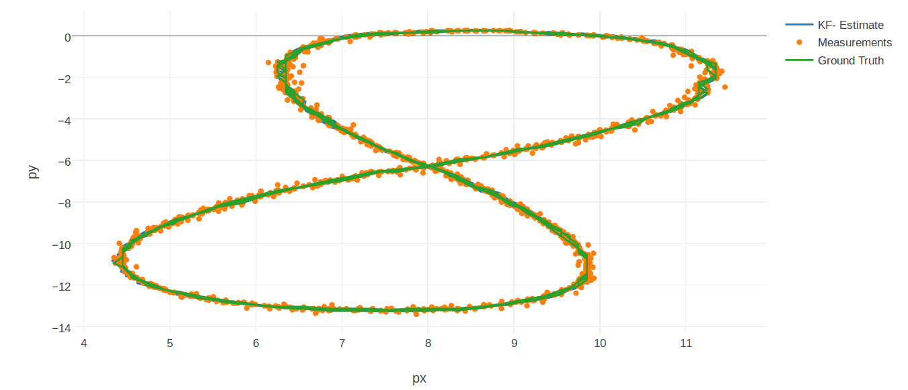

# Extended Kalman Filter Project

This is a turn-in project for Udacity's Self-Driving car program.  It 
is based on [Udacity's Starter Repo](https://github.com/udacity/CarND-Extended-Kalman-Filter-Project).
Visualization of the output is courtesy of the Jupyter visualization notebook 
[Sensor Fusion Toolkit](https://github.com/udacity/CarND-Mercedes-SF-Utilities) from the 
Mercedes team that accompanies the project.


## Code

The code is similar to the stock repo code, though I didn't like public variable
use and didn't think that it was as good an interface to the Kalman filter using 
two separate evaluation methods.  These were changed so that the concerns of the 
differnt data types are contained in `FusionEKF.cpp` only, allowing `kalman.cpp` 
to focus on the measurement and updat algorithm only.  A number of changes were 
made to the constructors and initialization along these lines.  All of this 
rather simplified the project.


## Build Instructions

Nothing new to see here...

```
mkdir build
cd build
cmake ..
make
./ExtendedKF ../data/sample-laser-radar-measurement-data-1.txt out.txt
```


## Results

The coefficients that are selected in `FusionEKF.cpp` were specifically selected to produce
decent results with `sample-laser-radar-measurement-data-1.txt`.  The way they were selected 
was by iteratively adjusting coefficients to reduce the RMSE.  These coefficients most 
definitely do not perform the same for the other data set.  Indeed, they are quite a bit different
in order to produce decent results with it, and are not really what I would have expected to 
minimize the RMSE.  That said, one's mileage may vary quite a bit applying this code directly to 
other data sets.  It is more than a bit troubling that there is not a one-size-fits-all collection 
of coefficients that works for both, as one would thing that barring a significant difference 
in process generating the two sets of points, the filter ought to track fairly uniformly.

Plotting the lissajous figure using the visualization toolkit generates the following image:



As you can see in the visualization, you can barely see the estimate since the ground truth nearly 
always covers it.  This will be discussed later, but do note that it is generally in areas 
with the most deviation from constant velocity that the errors are admitted.


## Further Experiments and Commentary

Using some manual quasi gradient decent to find the parameters that work well is pretty dumb, 
though instructive in understanding the practical effect of the parameters on the model.  What we
see is that almost none of the initial conditions have a long-term effect on the model.  That is
because the model doesn't have much memory, and because in computing the RMSE these initial errors 
average out fairly quickly.  The things that matter most, other than updating `F` and `Q` are the
measurement covariance matrices `Rl` and `Rr`.  This is because they, and the process variance that
is part of `Q`, determine the error characteristic of the update and measurement steps.  Most interesting
to me was that the state covariance matrix `P` did not show much effect with respect to the RMSE with
most any sane choice of values, so I just initialized it to `Zero`.

Since we have data including ground truth, we can easily see what the variance is of that data.  The
thought behind this is to either confirm that the selected coefficients are good, or to use this
new information as a basis of selecting the coefficients for the `Rl` and `Rr` matrices.  There is a 
program `stats.py` in the root of the project that does just this.  It uses the lidar data directly,
and performs a transform to the radar data, to determine a Cartesian variance in both position
and velocity.  The Cartesian velocity can be mapped back to the radian velocity, but the plot thickens
with regard to the radius and angle since the data is mixed rather than separate.  The interesting thing
is how small the variance for the positions are (makes sense, we have twice as much data and the sensors
are relatively accurate for position) and how large the variance is for the velocity (again makes sense,
as we have less data and of lower resolution).  This somewhat supports some of the general ideas about
the `Rl` and `Rr` matrices, but not in a directly corresponding manner.  Of course there are other
issues at play in the Kalman filter, such as the actual contribution of the error term through 
the Kalman gain, which would alter the effect of the running contribution of these values.  In any event,
here are the results of running `stats.py` on `sample-laser-radar-measurement-data-1.txt out.txt`:

```
px:  0.0030318456883
py:  0.00232796032072
vx:  1.75231650122
vy:  2.81928216089
rho:  3063.11545594
phi:  1.0680397691e-06
rho_dot:  3.08142854873

```

As you can see (and as expected), `rho` and `rho_dot` are not very good.  This propogates to the 
velocities `vx` and `vy` as well.  What I have found is that setting `Rl` and `Rr` based on these 
observations of process covariance works reasonably well, though it still requires some tuning to get 
the RMSE lower.  The `Q` matrix covariances appear to be governed by the process `rho` variance, as I
was unable to get the RMSE to be a minimum without driving up those values to the same order of magnitude
seen here with the variance of `rho`.  It certainly is helpful to have a priori knowledge of the 
error process to have a good starting point for the tuning!

In a relative sense, the performance of the filter is pretty good.  The RMSE is pretty low 
for positions, and the relative size of the RMSE for velocity is significantly lower than
the relative variance as computed from the data set.  That means that the filter is constructively
using the different data pieces to refine the estimates of both the position and velocity.  Since these
are mutual variables in the state of the filter, it is no surprise that improvements in one
generally come at the expense of the other.  We do not achieve a RMSE value for position as low as 
the variance in the data set, but we do have substantially better performance in terms of RMSE for
the velocity than the variance of the velocities from the data set would suggest. 

All of this really says that we can't get everything we want at once, and that the Kalman filter is 
limited in its ideal performance to something having to do with the quality of the data presented to 
it.  Since it has no memory, unless the data comes specifically from an unmoving Gaussian distribution
it will have convergence issues.  In our lissajous pattern data, we would not expect this idealistic
performance because the distribution of data is changing rather rapidly.  This is not unexpected 
since the model is posited around the idea of constant velocity.  Since we are moving effectively in
an orbit, this is not the ideal model.  It would be better for something with at best a very slowly
changing velocity with a very stable distribution of sampled data.  Things like tracking slow-moving
temperatures, aeronautical bodies moving at stable velocity and such are probably better cases for the 
extended Kalman filter than the lissajous figure in this exercise.  In any case, with some new 
assumptions, that is of course what the unscented Kalman filter is for.  
