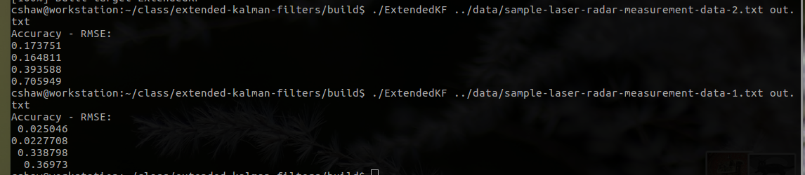

# Extended Kalman Filter Project

This is a turn-in project for Udacity's Self-Driving car program.  It 
is based on [Udacity's Starter Repo](https://github.com/udacity/CarND-Extended-Kalman-Filter-Project).
Visualization of the output is courtesy of the Jupyter visualization notebook 
[Sensor Fusion Toolkit](https://github.com/udacity/CarND-Mercedes-SF-Utilities) from the 
Mercedes team that accompanies the project.


## Code

The code is similar to the stock repo code, though I didn't like public variable
use and didn't think that it was as good an interface to the Kalman filter using 
two separate evaluation methods.  These were changed so that the concerns of the 
differnt data types are contained in `FusionEKF.cpp` only, allowing `kalman.cpp` 
to focus on the measurement and update algorithm only.  A number of changes were 
made to the constructors and initialization along these lines.  All of this 
rather simplified the project.


## Build Instructions

Nothing new to see here, just:

```
mkdir build
cd build
cmake ..
make
./ExtendedKF ../data/sample-laser-radar-measurement-data-1.txt out-1.txt
./ExtendedKF ../data/sample-laser-radar-measurement-data-2.txt out-2.txt
```


## A Note On Meeting The Accuracy Requirements

It is fairly hard to guess the right values for covariance matrices to meet the criteria for
one path, let alone two paths.  The simplest way to do this, given that we have the data sets
that include both the measured values and ground truth values, is to simply use these to determine
the proper values for the covariance matrices.

`stats.py` simply evaluates these data sets and reports the variance for all of the measurements.
Since the two data sets have slightly different results, I basically picked something along the 
lines of the simplest truncation that was close to both for each variance value.  This worked 
like a charm and gave results that were mutually within the rubric tolerance.


## Results

Numerically, this is what I get for RMSE for the two data sets using the submitted code.  Note that 
the second data set is presented first:



Plotting the lissajous figure using the visualization toolkit generates the following image.  This
is specifically for the first data set:


As you can see in the visualization, you can barely see the estimate since the ground truth nearly 
always covers it.  The most variation is at the areas where the lissajous figure curves
most rapidly.  This is not surprising given the nature of the Extended Kalman Filter with the linear 
nature of its prediction.

